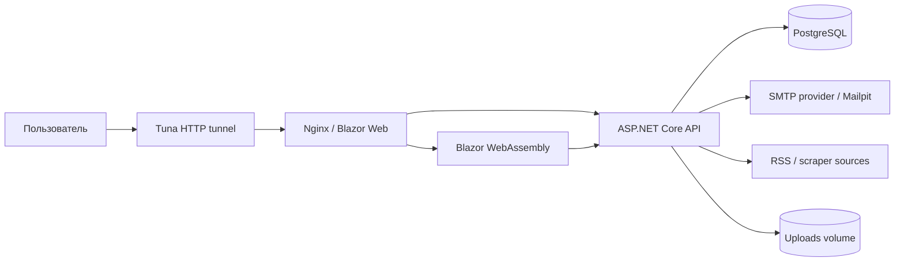

# Runews

## Цель Приложения

`Runews` - это новостной агрегатор с пользовательскими статьями, внешними источниками, системой модерации, комментариями и персональной лентой. Приложение помогает собрать новости из разных источников в одном интерфейсе, дополнить их авторским контентом и дать пользователям инструменты для чтения, сохранения, обсуждения и фильтрации материалов по интересам.

Основная аудитория проекта - читатели новостей, авторы публикаций, модераторы и администраторы платформы. Читатели получают ленту и подписки на теги, авторы могут публиковать статьи, модераторы проверяют материалы и жалобы, а администраторы управляют пользователями, тегами и сторонними источниками.

## Архитектура Приложения

Проект состоит из Blazor WebAssembly клиента, ASP.NET Core Web API, PostgreSQL и Docker-инфраструктуры. В hosted-сценарии Nginx отдает статические файлы Blazor и проксирует `/api`, `/hubs` и `/uploads` в API-контейнер. Внешний доступ локально можно открыть через HTTP-туннель Tuna на порт `80`.



Основные части:

- `CatshrediasNewsAPI` - backend: REST API, JWT, EF Core, PostgreSQL, SignalR, модерация, RSS/scraper, email.
- `CatshrediasNews.Client` - frontend: Blazor WebAssembly, страницы ленты, профиля, админки, модерации и редактора статей.
- `docker` - Dockerfile для API и клиента, Nginx-конфигурация для hosted-развертывания.
- `docker-compose.yml` - локальный/серверный запуск PostgreSQL, API, web и Mailpit.

## Документация Модулей

- [README_for_API](CatshrediasNewsAPI/README_for_API.md)
- [README_for_Blazor](CatshrediasNews.Client/README_for_Blazor.md)

## Запуск Через Tuna

Tuna используется как внешний HTTP-туннель к Docker-приложению. Приложение внутри Docker продолжает работать на локальном `localhost:80`, а Tuna выдает публичный HTTPS URL.

1. Подготовь `.env` в корне проекта:

```env
PUBLIC_URL=https://your-tuna-domain

POSTGRES_DB=news_db
POSTGRES_USER=postgres
POSTGRES_PASSWORD=postgres

JWT_KEY=CHANGE_ME_TO_A_SECURE_32_PLUS_CHAR_SECRET

SMTP_HOST=smtp-relay.brevo.com
SMTP_PORT=587
SMTP_FROM=noreply@your-domain.com
SMTP_USERNAME=your-smtp-login
SMTP_PASSWORD=your-smtp-password-or-api-key
SMTP_USE_SSL=true
SMTP_PREFER_IPV4=false
```

`PUBLIC_URL` должен быть URL, который выдал Tuna, без завершающего `/`.

2. Запусти Docker-стек:

```bash
docker compose up -d --build
```

3. В Tuna создай HTTP-туннель на локальный адрес:

```text
tuna http 80
```

4. Если Tuna выдал новый URL, обнови `PUBLIC_URL` в `.env` и перезапусти API/web:

```bash
docker compose up -d --build api web
```

## Возможные Улучшения

- Вынести отправку email в очередь/фоновые задачи, чтобы сбой SMTP не ломал регистрацию.
- Добавить полноценный CI/CD pipeline с проверкой сборки, тестов и Docker-образов.
- Расширить покрытие тестами для авторизации, модерации, scraper/RSS и клиентских сценариев.
- Добавить наблюдаемость: структурированные логи, метрики, health-check для БД/SMTP/источников.
- Улучшить рекомендации за счет истории просмотров, весов по категориям и скрытия неинтересных тем.
- Добавить object storage для загрузок вместо локального Docker volume.
- Разделить production-секреты и локальные `.env` через секрет-хранилище или переменные окружения сервера.
